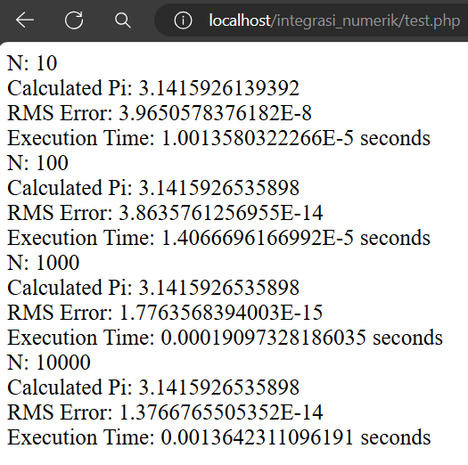

# Penghitungan Nilai π dengan Metode Integrasi Simpson 1/3

Proyek ini bertujuan untuk menghitung nilai π secara numerik dengan menggunakan metode Integrasi Simpson 1/3. Metode ini mengaproksimasi nilai integral dari fungsi \( f(x) = \frac{4}{1 + x^2} \) dari 0 hingga 1. Pengujian dilakukan dengan variasi nilai \( N \) (10, 100, 1000, 10000), dan hasilnya meliputi nilai π yang dihitung, galat RMS, dan waktu eksekusi.

## Struktur Proyek

- `main.php`: Berisi implementasi fungsi untuk menghitung nilai integral dengan metode Simpson 1/3, menghitung galat RMS, dan melakukan pengujian dengan berbagai nilai \( N \).
- `test.php`: Berisi kode testing untuk menguji fungsi penghitungan nilai integral dengan variasi nilai \( N \).

## Hasil Pengujian

Hasil pengujian menunjukkan bahwa nilai π yang dihitung semakin mendekati nilai sebenarnya (3.14159265358979323846) seiring dengan bertambahnya nilai \( N \). Galat RMS menurun dan waktu eksekusi meningkat seiring bertambahnya nilai \( N \).

